# FoldCode

[](LICENSE)

FoldCode is a native, offline-capable development environment for Android. It combines
an editor, terminal, build tools, language intelligence, debugging, Git, web preview,
and Raspberry Pi Pico development in one application. The interface adapts to phones,
foldables, tablets, external displays, and Samsung DeX.

FoldCode 1.0.0 installs large language runtimes and toolchains from locally selected
`.fcex` files. The public release does not contact an extension marketplace or extension
distribution server.

## Requirements

- Android 8.0 (API 26) or newer
- An ARM64 (`arm64-v8a`) Android device
- All files access for the shared `Internal storage/FoldCode/Projects` workspace
- Sufficient free storage for the selected extensions, dependencies, and build caches
- USB host/OTG support only when flashing a Raspberry Pi Pico over USB

The 1.0.0 release has been tested primarily on a Samsung Galaxy Z Fold 5. Other ARM64
phones, foldables, tablets, and desktop modes should work, but have not received the
same device-specific coverage.

## Features

- Responsive editor with multiple tabs, split editing, syntax highlighting, diagnostics,
  completion, breakpoints, and mouse/keyboard support
- Integrated project terminal with multiple sessions, ANSI output, clipboard support,
  command history, progress display, and process cancellation
- Local Git repositories and HTTPS Git operations
- On-device builds and execution without a remote build service
- Project templates for general-purpose languages, web development, and Raspberry Pi Pico
- Local WebView browser and web-project preview
- Raspberry Pi Pico configuration, incremental CMake/Ninja builds, MicroPython support,
  UF2 generation, and USB flashing

## FoldCode in action

These screenshots were captured from working projects on a Galaxy Z Fold 5 in folded,
unfolded, and Samsung DeX layouts. Select any image to open it at full resolution.

### General C++, Rust, and Python projects

<table>
  <tr>
    <td><a href="docs/screenshots/general-cpp-phone-editor.jpg">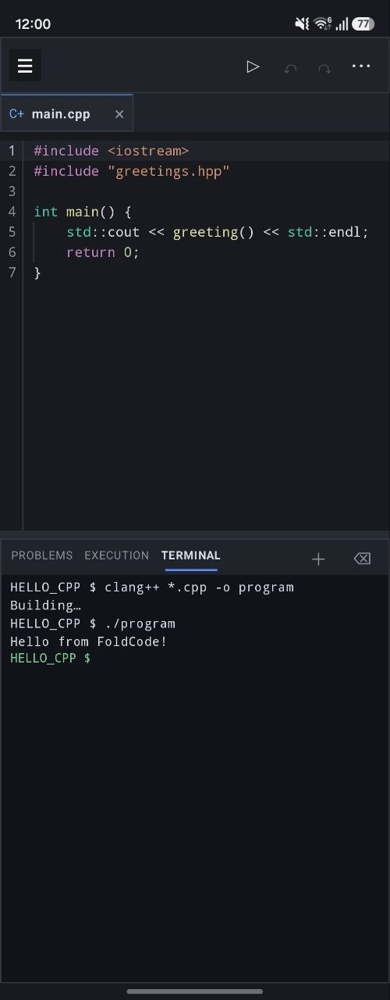</a></td>
    <td><a href="docs/screenshots/general-cpp-phone-explorer.jpg">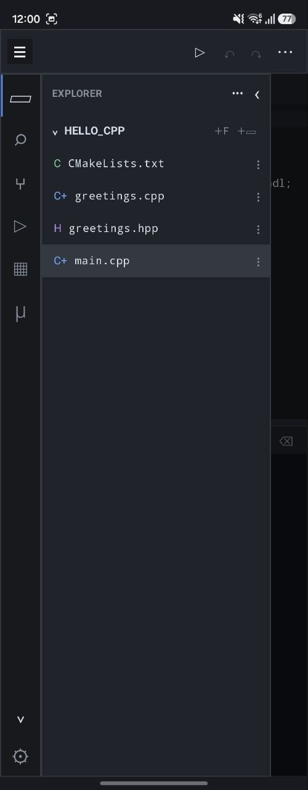</a></td>
    <td><a href="docs/screenshots/general-rust-phone.jpg">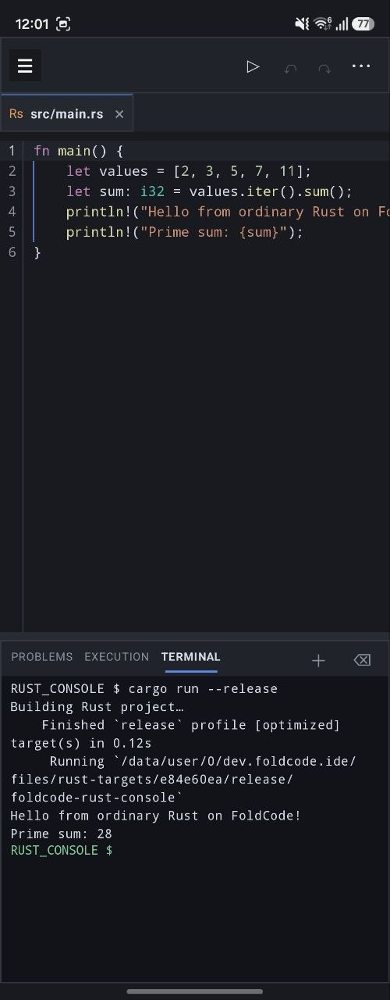</a></td>
    <td><a href="docs/screenshots/general-python-phone.jpg">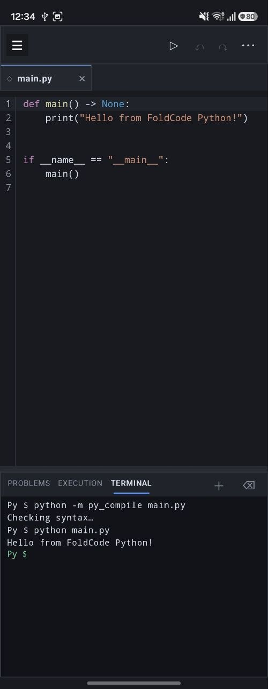</a></td>
  </tr>
  <tr>
    <td align="center"><sub>C++ build and execution</sub></td>
    <td align="center"><sub>C++ project explorer</sub></td>
    <td align="center"><sub>Rust with Cargo</sub></td>
    <td align="center"><sub>Python check and execution</sub></td>
  </tr>
</table>

### Web development

<p align="center">
  <a href="docs/screenshots/web-react-dex.jpg">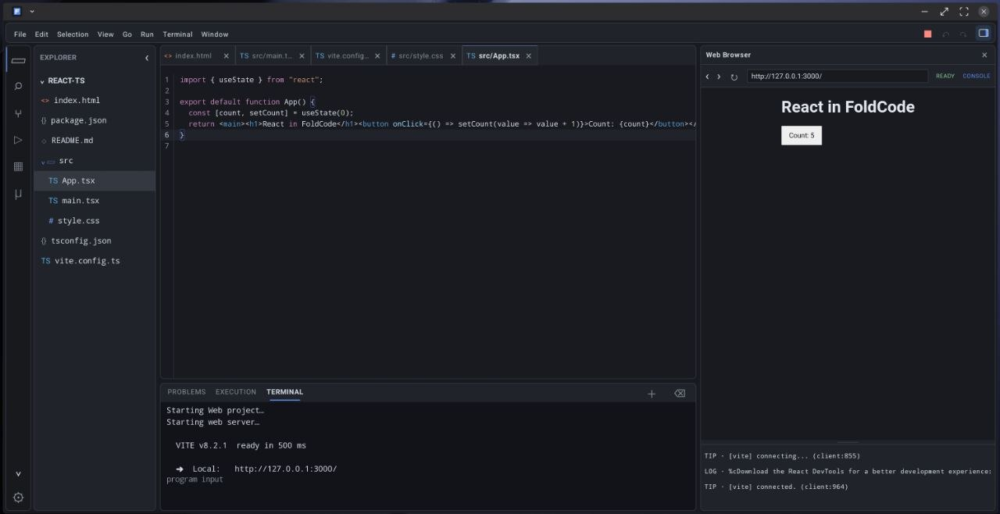</a><br>
  <sub>React and Vite on Samsung DeX with live preview, hot reload, and browser console</sub>
</p>

<table>
  <tr>
    <td><a href="docs/screenshots/web-vanilla-javascript-phone.jpg">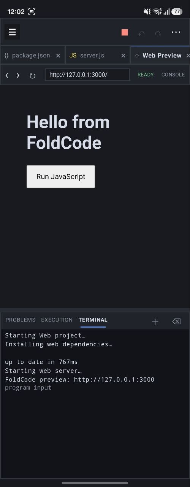</a></td>
    <td><a href="docs/screenshots/web-react-phone.jpg">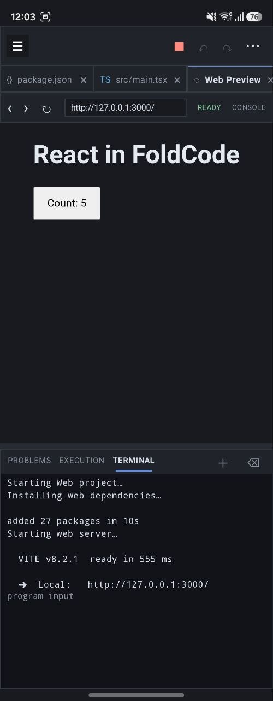</a></td>
  </tr>
  <tr>
    <td align="center"><sub>Vanilla JavaScript local server</sub></td>
    <td align="center"><sub>React and Vite preview</sub></td>
  </tr>
</table>

### Raspberry Pi Pico development

<p align="center">
  <a href="docs/screenshots/pico-build-dex.jpg">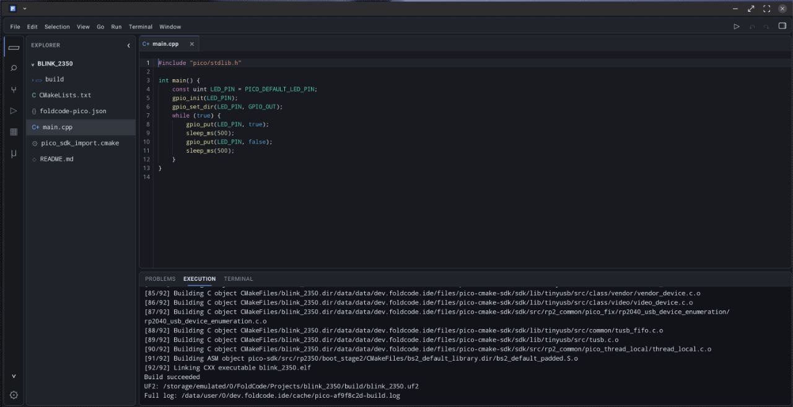</a><br>
  <sub>RP2350 C++ project and successful UF2 build on Samsung DeX</sub>
</p>

<table>
  <tr>
    <td><a href="docs/screenshots/pico-tools-phone.jpg">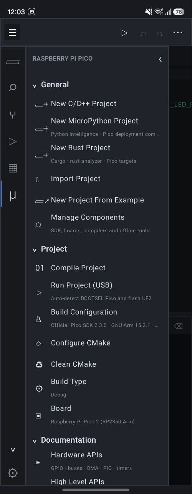</a></td>
    <td><a href="docs/screenshots/pico-build-phone.jpg">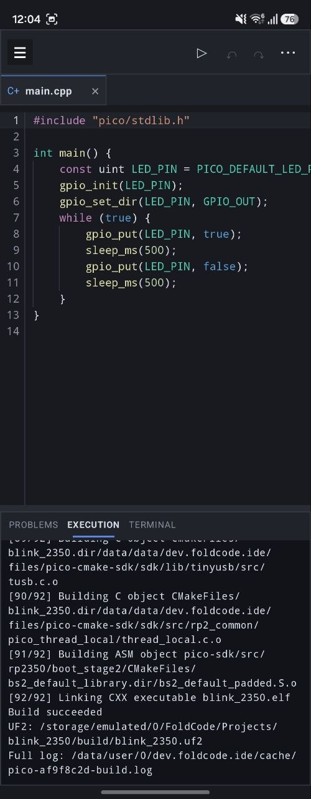</a></td>
  </tr>
  <tr>
    <td align="center"><sub>Pico tools, boards, and documentation</sub></td>
    <td align="center"><sub>Phone editor and UF2 build output</sub></td>
  </tr>
  <tr>
    <td><a href="docs/screenshots/pico-build-unfolded.jpg">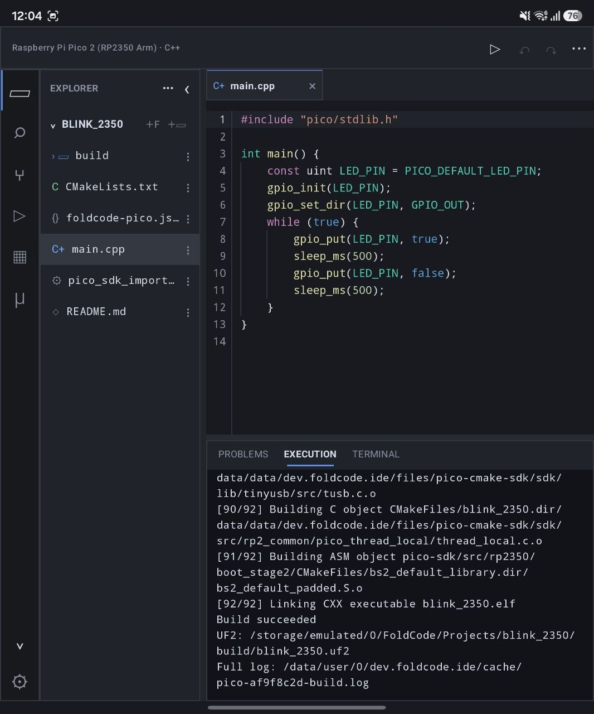</a></td>
    <td><a href="docs/screenshots/pico-picotool-unfolded.jpg">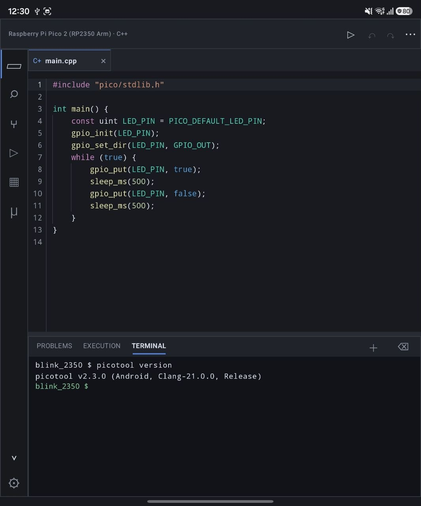</a></td>
  </tr>
  <tr>
    <td align="center"><sub>Unfolded project and build workspace</sub></td>
    <td align="center"><sub>Bundled picotool in the terminal</sub></td>
  </tr>
</table>

## Extensions

The base APK is the editor and workspace host. Install only the language packages you
need:

| Extension | Capabilities |
| --- | --- |
| C/C++ | Clang 21, clangd intelligence, LLDB debugging, CMake-compatible compilation, and local execution |
| Python | CPython 3.14.6, pip, Jedi intelligence, project-local packages, and MicroPython support |
| Rust | rustc, Cargo, rustfmt, rust-analyzer, and Pico embedded targets |
| Web Development | Node.js 24.19.0, npm 12, TypeScript, React, Vite, HTML/CSS/JSON intelligence, WebView preview, and JavaScript debugging |
| Raspberry Pi Pico | Pico SDK 2.3.0, CMake, Ninja, picotool, pioasm, board profiles, cross-toolchains, and MicroPython firmware |
| GNU Arm Embedded | Official Arm GNU Toolchain 15.2.Rel1 for projects requiring GCC-specific behavior |
| Fortran & COBOL | GNU Fortran and GnuCOBOL compilation, diagnostics, completion, and console execution |

Git support and the small Android-compatible command launchers are part of the base
application. Compiler libraries, SDKs, language servers, standard libraries, and other
large runtime data remain in independently installed extensions.

## Install FoldCode 1.0.0

1. Download `FoldCode-1.0.0-arm64-v8a.apk`, `SHA256SUMS`, and the `.fcex` packages you
   want from the GitHub release.
2. Verify the downloaded files against `SHA256SUMS`. On macOS, run
   `shasum -a 256 -c SHA256SUMS`; on Linux, run `sha256sum -c SHA256SUMS`.
3. Allow installation from the browser or file manager you used for the download, then
   install the signed APK.
4. Start FoldCode and grant the requested storage access.
5. Open **Extensions**, select an extension, choose **From file**, and select its `.fcex`
   release asset.

The first release publishes these packages:

- `foldcode-cpp-1.0.0-3.fcex`
- `foldcode-python-3.14.6-6.fcex`
- `foldcode-pico-2.3.0-18.fcex`
- `foldcode-rust-1.0.0-4.fcex`
- `foldcode-gnu-arm-15.2.1-1.fcex`
- `foldcode-gnu-languages-1.0.0-6.fcex`
- `foldcode-web-1.0.0-10.fcex`

The Android system file picker may show files differently from Samsung My Files or
Google Files. You can select an extension from any visible location; it does not have
to remain in `Downloads/FoldCode` after installation. FoldCode validates the package
manifest, legal metadata, payload set, path safety, byte counts, checksums, and minimum
host version before atomically activating it.

### Storage permission

FoldCode 1.0.0 uses a full-filesystem workspace so projects can be created, imported,
and used by native build tools under `Internal storage/FoldCode/Projects`. On Android
11 and newer this requires the special **All files access** permission. Android lists
that permission under **Special access**, so the ordinary App info → Permissions page
may still say “No permissions required.”

This permission is mandatory for the 1.0.0 workspace design. A future permission-free
workspace mode can use Android's document-provider storage model, but it is not part of
this release.

### Network and privacy

FoldCode does not include advertising, analytics, or telemetry SDKs. Android application
backup is disabled. The release APK rejects external cleartext network traffic; loopback
HTTP remains allowed for local web-project previews. WebView remote debugging is off by
default in release builds and is enabled only for an explicit active IDE browser-debug
session.

The Internet permission supports features initiated by the user, including the web
browser, HTTPS Git operations, npm and pip, and project dependencies downloaded by
tools such as CMake. Editing and local builds work offline after the required extensions
and project dependencies are installed. The production build has no extension catalog
URL and does not download extensions automatically.

## Python packages

Both `pip install` and `python -m pip install` use the open project's
`.foldcode/python` directory. This keeps dependencies isolated from the extension
runtime and from other projects. Pure-Python packages work normally.

The Python extension contains pinned Android ARM64 wheels for `cryptography`, `cffi`,
and `pycparser`, allowing Pico signing and encryption scripts to install those packages
without compiling Rust or C code on the device. Other native packages require wheels
compatible with CPython 3.14 on Android ARM64. Desktop Linux, macOS, and Windows wheels
are not compatible with Android.

## Raspberry Pi Pico projects

FoldCode recognizes Pico SDK projects from `pico_sdk_init()` and
`pico_sdk_import.cmake`, reads `PICO_BOARD`, and detects executable targets. Generated
examples and imported projects use the official full Pico CMake path, so multiple
targets, custom commands, SDK signing functions, and incremental Ninja builds remain
under CMake's control.

Projects copied from a desktop computer do not require `foldcode-pico.json`. FoldCode
creates its Android-local configuration when needed and does not rewrite the existing
`CMakeLists.txt` file. Configuration can use one of three dependency policies:

- **Ask before downloading** blocks configuration until the user decides.
- **Offline only** reuses project data and previously cached dependencies.
- **Allow during configuration** permits remote project dependencies.

Public HTTPS Git dependencies are placed in the project's `.foldcode/dependencies`
cache and reused by later builds. Python-based CMake generation requires the Python
extension. GCC-only projects require the GNU Arm Embedded extension. Absolute desktop
paths, desktop executables, and precompiled desktop libraries cannot be made portable
automatically and are reported by the compatibility scan.

Pico USB flashing requires a data-capable USB cable, Android USB host/OTG support, and
a board placed in BOOTSEL mode. Android asks for USB-device permission when needed.

## Build from source

The source build uses Android SDK 36, Android NDK 27.2.12479018, JDK 17, and Gradle's
checked dependency graph. FoldCode's small APK-owned ARM64 command hosts are deliberately
not committed as opaque binaries. Install the verified contributor bundle published with
the release:

```bash
tools/install-base-runtime.sh /path/to/foldcode-base-native-arm64-v1.zip
./gradlew assembleDebug
adb install -r app/build/outputs/apk/debug/app-debug.apk
```

Alternatively, set `foldcodeBaseNativeDir` in ignored `local.properties` to an equivalent
reviewed runtime directory. Gradle fails the APK build if a required host is absent.

The C/C++ extension is materialized under app-private `files/cpp-runtime/` storage.
Android-labelled launchers remain in the APK because Android does not permit arbitrary
execution directly from writable extension storage.

The Android source ownership map is documented in
[`app/src/main/java/dev/foldcode/ide/ARCHITECTURE.md`](app/src/main/java/dev/foldcode/ide/ARCHITECTURE.md).

## Contributing

Development setup, automated checks, CI behavior, and the optional Pico SDK compilation
matrix are documented in [CONTRIBUTING.md](CONTRIBUTING.md). Maintainers preparing a
signed public build should follow [RELEASE_CHECKLIST.md](RELEASE_CHECKLIST.md).

## License

Copyright 2026 Myroslav Poliakov.

FoldCode is licensed under the [Apache License 2.0](LICENSE). See [NOTICE](NOTICE) and
[THIRD_PARTY_NOTICES.md](THIRD_PARTY_NOTICES.md) for attribution and licenses applying
to bundled third-party material. Every schema-3 extension also carries its own notices
and exact source manifest.
